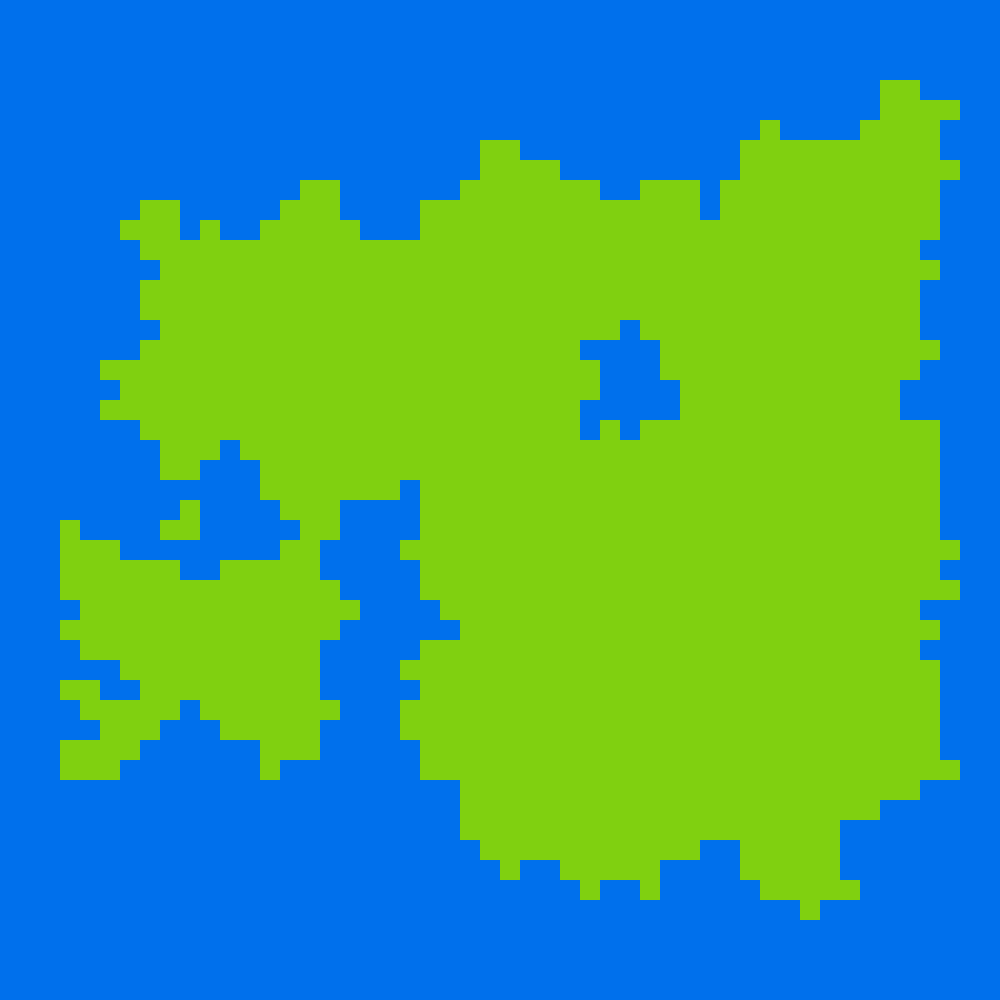

# Procedural Generation Code Along

You know the drill: fork and clone the repo!

This is a procedural generation demo in p5.

Starter code creates islands in a grid of equally-sized boxes, as shown:

Following the notes in sketch.js, we'll add trees that spread across the islands!
